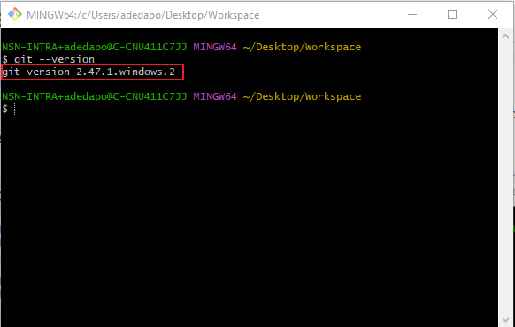
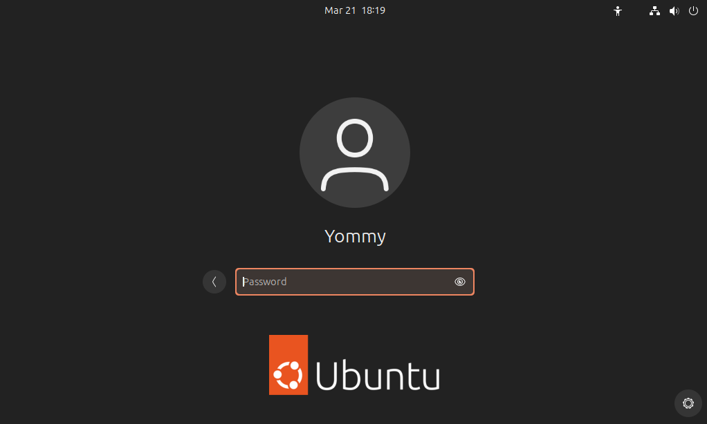

# Tech Environments Tools
This project is to install and set up tools needed for my deveops learning.

## 1. VS-CODE INSTALLATION FOR WINDOW
 `Installed Successfully`

.

## 2. GIT INSTALLATION
  `GIT Installed Successfully`

.

## 3. UBUNTU FOR WORKSTATION
 `Installed Successfully`

.

## 4. GITHUB ACCOUNT SETUP
`Account Successfully Created`

.

## 5. AWS ACCOUNT CREATION 
`Account Successfully Created`

.

