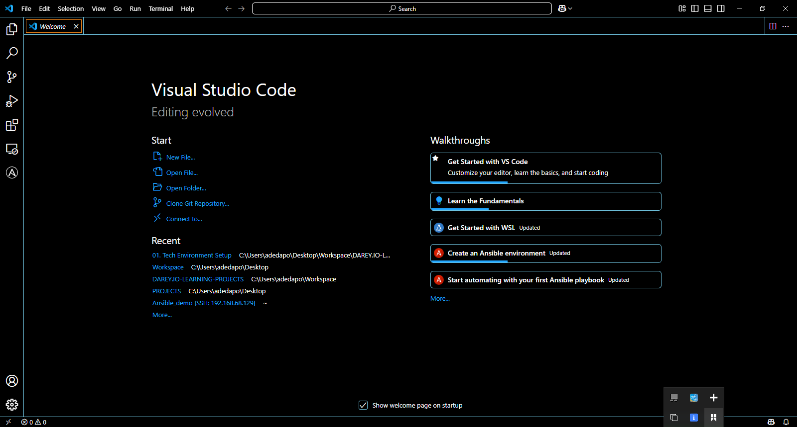

# Tech Environments Tools
This project is to install and set up tools needed for my deveops learning.

## 1. VS-CODE WELCOME SCREEN

.

## 2. GIT INSTALLATION CONFIRMATION
  `GIT Installed Successfully`

.
.
.

## 3. ORACLE VIRTUALBOX 

.

## 4. UBUNTU Login Prompt

.

## 4. GITHUB ACCOUNT SETUP

.

## 5. AWS ACCOUNT CREATION 

.

