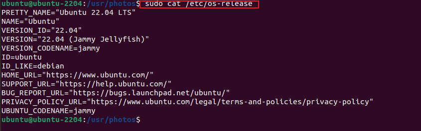
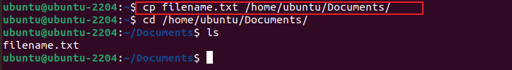
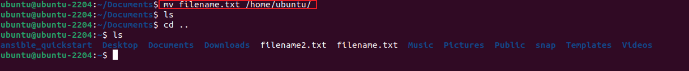
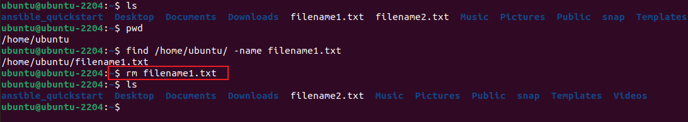
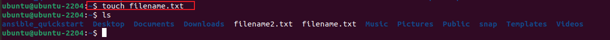
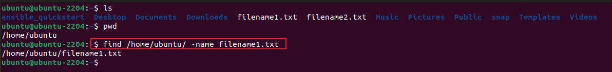

# LINUX COMMANDS DEEP DIVE

This Project is showcase my mastery of linux commands and their used cases.

## Creating a folder with Sudo
   ### mkdir /root/example
     

   ### sudo mkdir /root/example
       

## PWD Command
   ### pwd [user directory] 
       
   ### pwd [Root directory] 
        

## SIDE HUSTLE TASK 
   ### Task 1
     
   ### ls command with flags : ls -R , ls -a , ls -lh
      
   ### cat 
     
   ### cp , cp -R , mv , rm , touch ,find 
    
    
    
    
    
    

 * Project Repo :   
