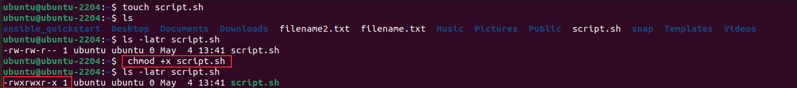
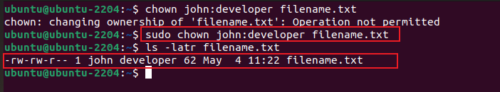
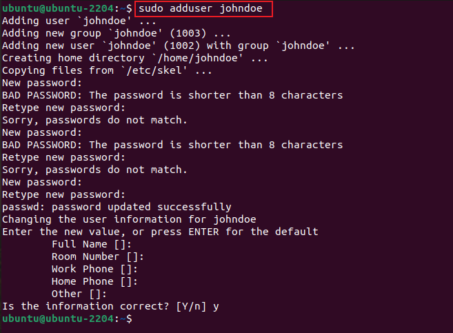
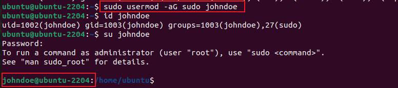
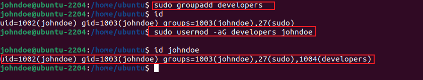
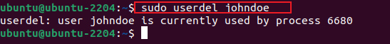

# Advance Linux Command Project
This project is to showcase deep understaning of Linux Commands with implementation of them in some simple use cases.

## File Permission Commands

* chmod

   **chmod +x script.sh**
    
   **chmod 755 script.sh**
    

* chown

   **chown john:developer filename.txt**
    

## SuperUser Privileges

 * Switching to Root :   **sudo -i**
   

 * Creating User   : **sudo adduser johndoe**
   

 * Granting admin privilege :     **sudo usermod -aG sudo johndoe**
    

 * Modifying user account :  **su johndoe** , **sudo passwd johndoe**
   

 * Creating group :    **sudo groupadd developers** ,
                     **sudo usermod -aG developers johndoe**
      

 * Deleting user :  **sudo userdel username**
     
   
              
 

   

 

 