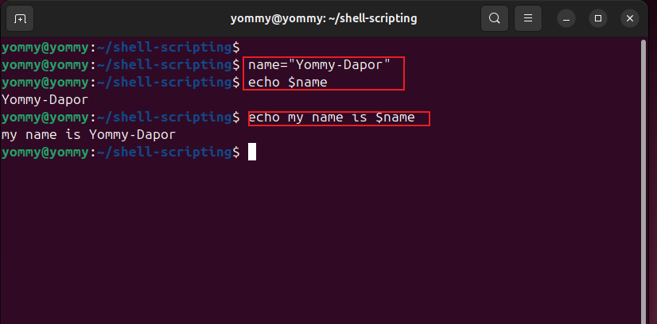

# Shell Scripting

Shell scripting is a way to automate tasks, processes, and workflows by writing a series of commands(instructions) in a file that can be executed by the shell(command-line interpreter).

### Key Features

- 1. Automation: Automate repetitive tasks, backups, and system maintenance.

- 2.Customization: Create custom workflows, tools, and scripts tailored to specific needs.

- 3.Efficiency: Save time and effort by executing multiple commands with a single script.

### Use Cases

1. Automation of repetitive tasks
2. System administration
3. Data processing and manipulation
4. Deployment and configuration management
5. Backup and recovery

Shell scripting is a powerful tool for streamlining workflows, improving productivity, and simplifying complex tasks. Below is a demo on shell scripting:

### Tasks

1. Creation of a folder on an ubuntu server and naming it shell-scripting

2. Using of `vim` editor to create a file called "my_first_shell_script.sh"

3. Populating and saving the scripts with instructions

4. Changed directory to shell-scripting and typed `ls -latr` command to confirm that the file was created

As seen in the picture:

1. The owner of the file has read(r) and write(w) permissions.

2. Members of the fil's group have read(r) permission.

3. Others also have read(r) permission.

No one has the execute permission, hence the script cannot be executed.
To confirm this `./my_first_shell_script.sh` was ran and below was the output

- ./ prefix to the flie indicates that the command should look for the file in the current directory.

To fix this and run the script, the following was done :

1. Excute permission was added for the owner

2. Ran the script

3. Evaluated an ensure that 3 folders were created

4. Evaluated and ensure that 3 users were created on the linux server

4.Variable Declaration and Initialization

In programming generally, not just shell scripting, varaibes are essentials for creating dynamic and flexible programs.
Variables can store data of various type such as numbers, strings, and arrays. Values can be assigned to variables using the "=" operator, and access their values using the cariable name preceded by a $ sign.
