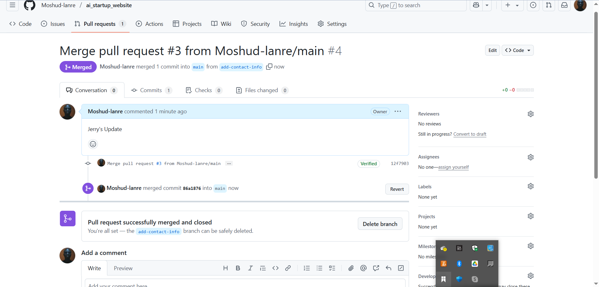
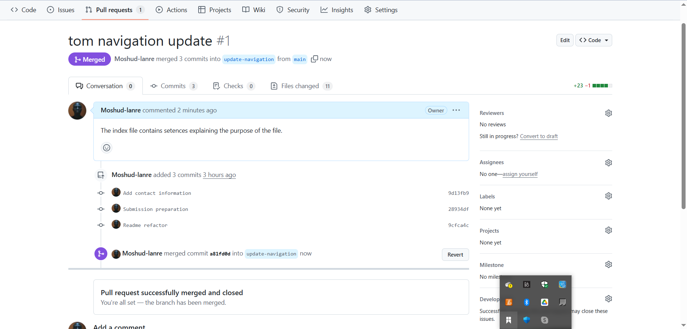
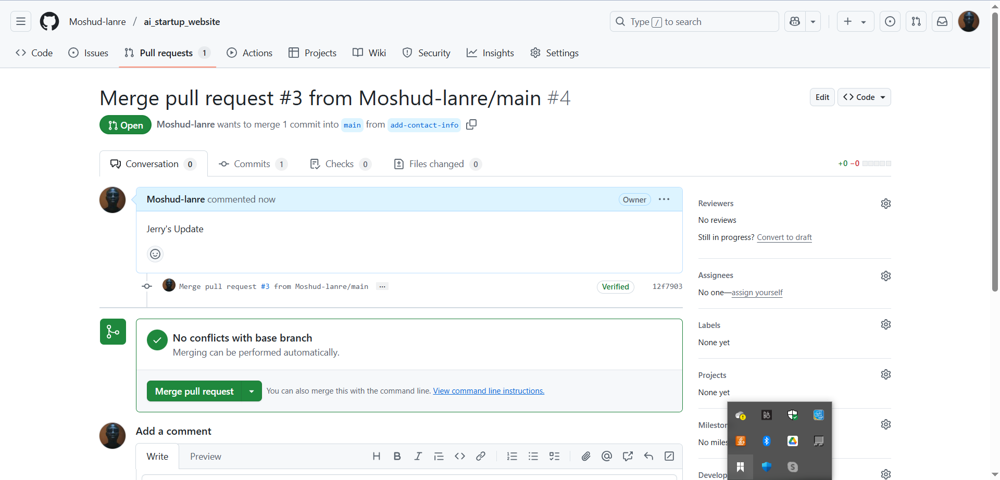
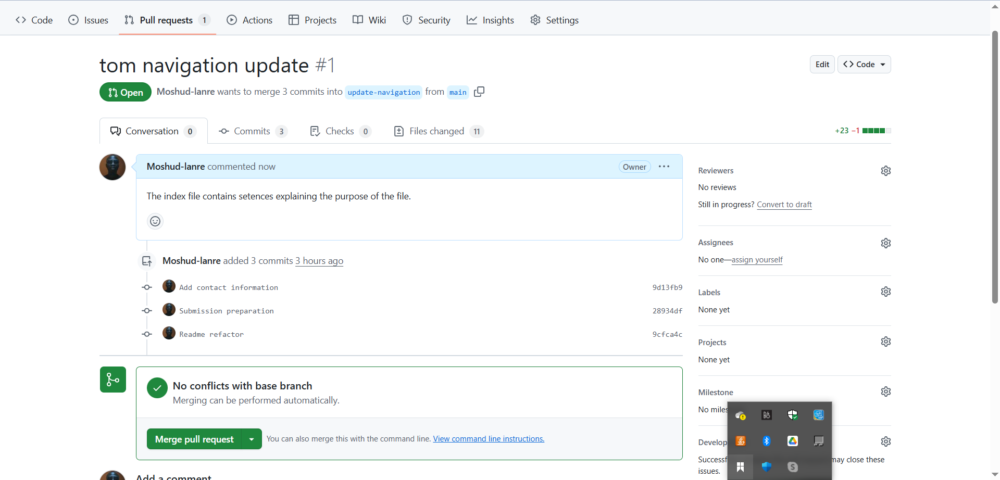

# ai_startup_website

This mini project simulates the collaboration between two software engineers with the use of GitHub.
The project involves step-by-step project to simulate workflow of Tom and Jerry using Git and GitHub. The project includes the installation of Git, setting up a GitHub repository, cloning the repository, creation of branches, making changes, and merging those changes into the main branch.

### Part 1 Setup and Initial Configuration

 * Install git 

- Create and Clone repository 

- First commit : 

    *git status*  
    *git commit -m "This is my first commit"*
 

### Part 2: Simulating Tom and Jerry's Work

- 1. Tom's Work:

  - create branch 

     *git branch*  
    *git checkout -b update-navigation*

  

  - Commit and push update

     *git push origin update-navigation*

  
  

- 2. Jerry's Work

  - create new branch

     *git checkout main*   
    *git pull origin update-navigation*  
     *git checkout -b add-contact-info*

  
  

  - update index file 

     *git push origin add-contact-info*

  
  

  ### Part 3: Merging Changes
  
   - 1. Tom's PR : 
   - 2. Tom's PR merge : 
   - 3. Brach Update and Synchronization 
   - 4. Jerry's PR: 
   - 5. Jerry's PR merge: 

   Repo link : https://github.com/ABAYOMI-ADEDAPO/DAREY.IO-LEARNING-PROJECTS/tree/main/Basic-Git-Command